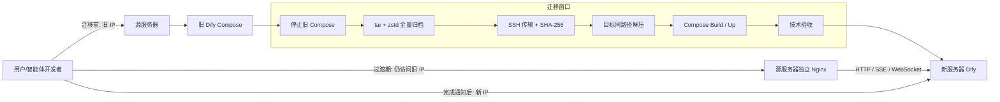

# HET Dify 专属服务器全量迁移方案

> 文档性质：架构方案 + 可执行 Runbook  
> 源项目路径：`/data/angelen/dify`  
> 迁移方式：单机 Docker Compose → 单机 Docker Compose  
> 数据规模：当前估计小于 100 GB，正式执行前必须实测  
> 业务切换：新服务器启用后，源服务器独立 Nginx 暂时转发到新 IP  
> 版本策略：迁移期间完全冻结，不同时升级 Dify  
> 状态：目标服务器基础规格已确定，待源服务器只读盘点、目标 IP 和演练数据补齐

---

## 1. 目标与成功标准

### 1.1 迁移目标

将当前 HET 定制版 Dify 从现有服务器完整迁移到一台新申请的专属服务器，包括：

- Git 仓库及未纳入 Git 的本地文件；
- Docker Compose 编排与环境变量；
- PostgreSQL 业务库和插件库；
- Redis 持久化数据；
- Weaviate 向量数据及备份目录；
- Dify 上传文件与知识库原文件；
- 插件安装状态、插件包、运行环境和插件凭据；
- Sandbox 配置及 Excel 相关依赖；
- HET 定制代码、脚本与 Docker 本地构建配置；
- 1Panel 中需要重建的自动备份任务；
- 数据库中的业务日志、会话、审计记录。

容器 stdout/stderr 历史日志不要求恢复，可在源服务器归档保存。

### 1.2 成功标准

迁移成功必须同时满足：

1. 新服务器运行冻结版本的相同代码和 Compose 配置；
2. 用户、工作区、应用、工作流、知识库、会话、文件与插件均可正常访问；
3. HET 定制能力未发生回退；
4. PostgreSQL、Weaviate、文件存储及插件数据校验通过；
5. 旧 IP 经独立 Nginx 可正确代理 HTTP、SSE、WebSocket 和文件上传到新 IP；
6. 技术验收通过后才开放普通用户写入；
7. 原 Compose 停止但数据和正式备份保留 30 天；
8. 所有智能体开发者完成新 IP 修改后，才撤销旧 IP 转发。

### 1.3 已确认约束

- 目标形态：单台专属服务器运行完整 Docker Compose；
- 网络：新旧服务器处于同一内网，可通过 SSH/rsync 传输；
- 目标 IP：固定内网 IP；
- CPU：`16` 核；
- 内存：`32 GB RAM`，当前 Dify 历史峰值约 `20 GB`；
- CPU 架构：`x86_64/AMD64`；
- 操作系统：`Ubuntu 24.04 LTS`；
- 存储：`1 TB`，使用单一根文件系统，`/data` 不单独分区；
- 权限：新旧服务器均具备 root 权限；
- 互联网：目标服务器可以访问互联网和构建依赖源；
- 路径：目标服务器继续使用 `/data/angelen/dify`；
- 端口：保持现有服务端口和 URL 路径，仅 IP 改变；
- 停机：允许数小时，以完整可靠为优先；
- 执行时间：周末维护窗口；
- 正式备份：先停止旧 Compose，再制作一致性备份；
- 归档：先 `tar` 保存 Linux 元数据，再用 7z 压缩；
- 归档保护：依靠 SSH、root 文件权限和内网传输，不额外加密；
- 备份副本：只保留源服务器与目标服务器两份；
- 演练：在最终目标服务器上执行一次完整恢复演练；
- 构建：目标服务器重新执行 `docker compose build`，正式停机前完成预构建；
- 1Panel：目标服务器重新安装，必要配置和定时任务手工重建；
- 回滚：核心链路任一失败即回滚；开放写入后回滚时接受新端增量数据丢失。

---

## 2. 当前项目迁移对象

### 2.1 当前核心服务

根据当前 `docker/docker-compose.yaml`，迁移重点包括：

- `api`：HET 定制后端，本地镜像 `dify-api:1.14.2`；
- `worker`、`worker_beat`：Celery 异步任务与周期任务；
- `api_websocket`：协作场景的 WebSocket 服务，按实际启用 profile 判断；
- `web`：HET 定制前端，本地镜像 `dify-web:1.14.2`；
- `db_postgres`：PostgreSQL 15；
- `redis`：Redis 6；
- `weaviate`：Weaviate 1.27.0，启用 filesystem backup；
- `plugin_daemon`：插件守护进程及插件本地存储；
- `sandbox`：代码执行服务，包含 HET 增加的 Excel 依赖；
- `ssrf_proxy`：Squid，包含 HET 内网访问放行；
- `nginx`：当前 Compose 入口服务；
- `certbot`：若实际启用，则证书目录也要迁移。

Compose 文件还包含多种可选向量数据库 profile。正式盘点必须使用 `docker compose ps`、`docker inspect` 和 `docker compose config --services` 确认实际运行集合，不能仅按文件中出现的服务推断。

### 2.2 项目内持久化目录

已确认当前主要数据使用项目内 bind mount：

| 数据 | 源路径 | 容器路径 | 迁移要求 |
|---|---|---|---|
| 应用/上传文件 | `docker/volumes/app/storage` | `/app/api/storage` | 必须完整保留权限和时间戳 |
| PostgreSQL | `docker/volumes/db/data` | `/var/lib/postgresql/data` | 停库后物理复制；另做逻辑备份 |
| Redis | `docker/volumes/redis/data` | `/data` | 停服后复制；启动前检查 RDB/AOF |
| Weaviate | `docker/volumes/weaviate` | `/var/lib/weaviate` | 停服后复制；另做 Weaviate backup |
| 插件 | `docker/volumes/plugin_daemon` | `/app/storage` | 必须保留插件包、环境、媒体和凭据引用 |
| Sandbox | `docker/volumes/sandbox` | `/dependencies`、`/conf` | 必须保留 HET 依赖和 syscall 配置 |
| Certbot | `docker/volumes/certbot` | `/etc/letsencrypt` 等 | 实际启用时迁移 |

> 注意：Compose 还声明了 `oradata`、`dify_es01_data` 等命名卷。即使当前认为未启用，正式盘点仍必须检查 `docker volume ls` 和运行容器的 `Mounts`，防止遗漏 profile 服务的数据。

### 2.3 基于当前 `.env` 的实际配置结论

已读取当前生产 `docker/.env` 并与 Compose 对照，确认以下事实。文档不记录任何密码、Token、API Key 或密钥值。

**当前实际部署形态**

- 仅存在单文件 `docker/.env`，`docker/envs/**/*.env` 当前不存在；Compose 中拆分 env 文件均为 optional，最终实际配置由 `docker/.env` 提供；
- `.env` 已被 `docker/.gitignore` 忽略且未被 Git 跟踪，因此 Git clone 不会带到新服务器，必须依靠全量归档迁移；
- 数据库为 Compose 内 PostgreSQL，Redis 为 Compose 内单节点 Redis；
- 文件存储为 OpenDAL 本地文件系统，根目录落在应用 storage bind mount；
- 向量库为 Compose 内 Weaviate；
- 插件存储为本地目录；
- collaboration/WebSocket 模式关闭，静态渲染出的服务集合不包含 `api_websocket`；
- 当前入口为 HTTP，宿主机暴露端口为 `18080`，HTTPS 未启用；
- 当前 Docker 未发现正在运行的本项目容器；正式执行时仍需在生产运行期间重新采集容器和 Mounts 清单。

**迁移时必须修改的地址**

下列配置当前硬编码为旧服务器外部 IP 和端口，迁移后必须统一替换为新服务器外部 IP 与相同端口：

- `CONSOLE_API_URL`
- `CONSOLE_WEB_URL`
- `SERVICE_API_URL`
- `TRIGGER_URL`
- `APP_API_URL`
- `APP_WEB_URL`
- `FILES_URL`
- `INTERNAL_FILES_URL`

其中 `INTERNAL_FILES_URL` 是 HET 环境的特殊约束：虽然名称带 `INTERNAL`，但外网插件需要使用该地址下载签名文件，因此必须配置为插件可访问的**容器外部地址**，不能改为 `http://api:5001`。

**迁移时必须原样保留的配置**

- `SECRET_KEY`；
- PostgreSQL、Redis、Weaviate、Sandbox 和 Plugin Daemon 的现有认证值；
- `PLUGIN_DIFY_INNER_API_KEY` 与配套的插件内部认证配置；
- 本地存储、Weaviate、PostgreSQL、Redis 等后端类型；
- 文件上传、工作流、并发和超时等 HET 调优参数；
- SMTP、插件市场及内部/外部服务配置，除非新 IP 或网络策略要求调整。

真正的容器内部地址应保持不变，例如 `DB_HOST=db_postgres`、`REDIS_HOST=redis`、Weaviate service 地址、Sandbox service 地址及 `PLUGIN_DIFY_INNER_API_URL=http://api:5001`。

**新增确认的迁移风险**

1. `.env` 当前文件权限过宽（实测为 `777`），且包含会话加密密钥、数据库/Redis/Weaviate/插件/SMTP 凭据。迁移包和目标端恢复后应立即将其收紧为 root 或部署用户可读，例如 `600`；修改前需确认 Compose 执行用户仍可读取；
2. 多个公开 URL 硬编码旧 IP。如果漏改，新服务会继续生成旧 IP 的 API、触发器、WebApp 和文件链接，形成对旧 Nginx 的永久依赖；
3. `ENDPOINT_URL_TEMPLATE` 当前使用 `localhost`，插件 endpoint/hook 若提供给远程调用方可能不可达。正式盘点需确认该功能是否使用；如使用，应改为新服务器外部可达地址；
4. 周期工作流轮询、人类输入超时检查和插件升级检查均已启用。演练或目标端提前启动全部服务时可能触发真实任务，原方案中的“演练副作用风险”确认成立；
5. 自动数据库 migration 已启用。同一冻结版本通常不会产生新迁移，但目标端首次启动前仍必须完成最终备份，禁止迁移时顺带升级代码；
6. SMTP、插件市场、更新检查和模型/工具请求存在外部网络依赖，新服务器需验证 DNS、出口、防火墙及可能的源 IP 白名单；
7. 当前为 HTTP、宽 CORS、Swagger 开启、Weaviate 匿名访问开启、插件签名强制校验关闭。这些属于现有安全基线风险，不应在正式迁移窗口同时整改；建议迁移稳定后单独安排安全加固窗口；
8. `RESPECT_XFORWARD_HEADERS_ENABLED` 当前关闭。旧 Nginx 代理可以正常转发业务，但应用侧可能无法准确识别原始客户端 IP/协议；由于当前使用 HTTP 和显式绝对 URL，迁移时先保持不变，观察期再评估是否启用。

### 2.4 必须保留的 HET 定制能力

迁移后应专门回归：

1. App 修改、删除和覆盖导入的创建者权限限制；
2. 会话软删除，Web 端删除后 Console 仍可查看；
3. HTTP 非安全上下文的剪贴板复制；
4. 工作流变量块 ErrorBoundary；
5. 文件上传数量上限及工作流文件上传；
6. Sandbox 的 `openpyxl`、`xlsxwriter`、`xlwt`、`xlrd`；
7. Weaviate 备份卷和迁移脚本；
8. SSRF Proxy 访问内网能力；
9. share 匿名页不跳转 Console `/signin`；
10. 本地构建镜像和国内依赖源配置。

---

## 3. 总体迁移架构



### 3.1 迁移原则

- **版本与迁移分离**：迁移窗口不升级 Dify、不变更业务功能；
- **先演练后正式**：在目标服务器用最近一次备份完整恢复并记录耗时；
- **停写后备份**：旧 Compose 停止后再做最终归档，保证文件一致性；
- **双备份策略**：完整目录归档作为主恢复介质，PostgreSQL/Weaviate 逻辑备份作为兜底；
- **同路径恢复**：保持 `/data/angelen/dify`，降低 bind mount、脚本和配置路径风险；
- **先校验后开放**：技术验收通过后才允许用户写入；
- **旧端仅代理**：正式切换后旧 Compose 不再启动，仅独立 Nginx 转发；
- **保留回滚点**：源数据、正式归档及原配置保留 30 天。

### 3.2 分阶段实施计划（单人粗排期）

> 排期基准日期：2026-07-29  
> 实施人员：1 人  
> 日常投入：工作日每天约 1～2 小时，不安排周末准备工作  
> 正式迁移：2026-08-22（星期六）13:00 开始，计划约 4 小时；是否延长或回滚根据现场进度决定

| 日期 | 阶段 | 主要工作 | 预计个人投入 | 完成标志 |
|---|---|---|---:|---|
| 7 月 29 日～8 月 7 日 | 前期准备与源端盘点 | 完善方案；检查源服务器资源、数据目录、Compose、`.env`、备份脚本、端口和外部依赖；提交并跟进服务器申请 | 5～8 小时，分散完成 | 盘点信息基本齐全，目标服务器交付 |
| 8 月 3 日～8 月 7 日 | 目标服务器初始化 | 安装 Ubuntu 24.04 LTS、Docker 官方 stable 最新版、1Panel 和迁移工具；配置固定 IP、SSH、目录、日志轮转和基础告警 | 3～5 小时 | Docker、Compose、Buildx、网络及磁盘验证通过 |
| 8 月 6 日～8 月 11 日 | 代码同步与预构建 | 同步冻结版本代码和配置结构，提前拉取基础镜像并构建 `api`、`web`，保存 Docker 版本及镜像基线 | 2～4 小时，不含后台构建时间 | 目标端镜像构建成功，Compose 配置可正常渲染 |
| 8 月 10 日～8 月 14 日 | 完整恢复演练 | 使用当时最新自动备份恢复；验证解压、权限、启动、数据、插件、文件、HET 定制及旧 IP Nginx 转发；记录耗时和问题 | 5～8 小时，分多天完成 | 至少完成一次可启动、可验证的恢复演练，并修复阻塞问题 |
| 8 月 17 日～8 月 21 日 | 正式迁移前收尾 | 根据演练修订步骤；冻结 Git、Compose、`.env` 和 Docker 版本；检查新旧服务器空间与网络；准备 Nginx；临时通知用户 | 3～5 小时 | 正式迁移检查清单通过，无已知阻塞项 |
| 8 月 22 日 13:00 起 | 正式迁移 | 停止源 Compose；制作最终 `tar + zstd -T0 -15` 一致性归档并经 SSH 传输；校验、恢复、启动、技术验收和旧 IP 代理切换 | 计划约 4 小时 | 新端核心功能通过，旧 IP 可代理到新端；否则现场决定延长或回滚 |
| 8 月 24 日起 | 观察与收尾 | 观察资源和错误；处理用户反馈；通知开发者改新 IP；重建 1Panel 自动备份；保留源端回滚点 | 每天约 0.5～1 小时，按需 | 所有开发者完成新 IP 切换，新端备份验证成功 |
| 迁移成功后至少 30 天 | 旧端保留与退役 | 源 Dify Compose 保持停止，保留原数据和正式备份；确认旧 IP 无业务访问后停止 Nginx并退役 | 按需 | 满足退役条件并完成旧服务器清理 |

**排期说明**

- 目标服务器按 8 月 3～7 日交付估算；若交付晚于 8 月 7 日，应相应顺延演练或正式迁移日期，不压缩演练；
- 当前全量自动备份约 73 GB，`zstd -T0 -15` 耗时约 6000～7000 秒（100～117 分钟），且数据仍在增长；正式迁移 4 小时窗口偏紧；
- 1 Gbps 内网传输 80 GB 的理论下限约 11 分钟，实际应预留约 20～35 分钟；最终以演练实测为准；
- 正式迁移前必须完成预构建，不能把大规模镜像下载和首次构建放入停机窗口；
- 你是唯一实施人员，因此演练、正式迁移和回滚操作均采用清单执行，避免同时处理多个高风险步骤。

---

## 4. 阶段一：源服务器只读盘点

目标服务器申请前必须完成盘点。以下命令均应避免输出 `.env` 中的密钥值。

### 4.1 系统与资源盘点

```bash
uname -a
cat /etc/os-release
lscpu
free -h
df -hT
lsblk -f
docker version
docker compose version
docker info
```

记录：

- OS 版本、内核、CPU 架构；
- CPU 核数与过去 7～30 天峰值；
- 内存总量、峰值及 Swap；
- 数据盘文件系统、总容量、已用空间、inode；
- Docker data-root；
- Docker 与 Compose 版本；
- 时间同步、时区、DNS、代理配置。

如果 1Panel 能提供历史监控，应导出至少 7 天 CPU、内存、磁盘 IO 和网络峰值，用于目标规格推导。

### 4.2 Compose 与容器盘点

```bash
cd /data/angelen/dify/docker
docker compose config > /root/dify-compose-rendered.yaml
docker compose config --services
docker compose ps -a
docker ps --format '{{.Names}}\t{{.Image}}\t{{.Status}}\t{{.Ports}}'
docker images --digests --no-trunc
docker volume ls
docker network ls
```

对所有运行容器保存挂载清单：

```bash
docker inspect $(docker compose ps -q) \
  --format '{{.Name}}{{range .Mounts}}\n  {{.Type}} {{.Source}} -> {{.Destination}}{{end}}' \
  > /root/dify-container-mounts.txt
```

必须确认：

- 实际启用的 Compose profiles；
- 是否存在项目目录外 bind mount；
- 是否存在实际使用中的 Docker named volume；
- 当前暴露的全部 IP/端口；
- `api_websocket` 是否启用；
- 当前项目名是否固定为 `dify`。

### 4.3 数据量盘点

```bash
du -sh /data/angelen/dify
du -sh /data/angelen/dify/docker/volumes/*
du -xhd2 /data/angelen/dify/docker/volumes | sort -h
```

数据库逻辑规模：

```bash
cd /data/angelen/dify/docker
docker compose exec -T db_postgres \
  psql -U "${DB_USERNAME:-postgres}" -d "${DB_DATABASE:-dify}" \
  -c "SELECT pg_size_pretty(pg_database_size(current_database()));"
```

执行时应从实际 `.env` 加载变量，不在命令记录中回显密码。

### 4.4 配置与外部依赖盘点

检查但不要将密钥打印到日志：

- `docker/.env`；
- `docker/envs/**/*.env`；
- `CONSOLE_API_URL`、`APP_API_URL`、`SERVICE_API_URL` 等地址；
- 模型 API、内部模型服务、MCP、插件市场；
- SMTP、Webhook、SSO、对象存储、Sentry；
- 按源 IP 配置的白名单、回调和防火墙；
- 1Panel 定时任务、Nginx、证书与防火墙；
- systemd、cron、宿主机脚本；
- 当前每 3 天执行一次的全量备份脚本。

### 4.5 已确定的目标服务器规格与容量评估

目标服务器基础规格已确定：

| 项目 | 确定配置 | 评估 |
|---|---|---|
| CPU | 16 核 x86_64/AMD64 | 可以承载当前单机 Compose；迁移后需复核 API、Celery、Weaviate 与 PostgreSQL 的共同峰值 |
| 内存 | 32 GB RAM | Dify 历史峰值约 20 GB，剩余约 12 GB，即 37.5% 余量；可用但不属于高冗余配置 |
| 存储 | 1 TB | 当前数据估计小于 100 GB，容量充分；正式盘点后仍需验证归档、构建缓存和未来增长 |
| 文件系统 | 1 TB 单一根文件系统，`/data` 不独立分区 | 部署简单，但系统、Docker、业务数据、tar/7z 和日志共享同一空间，磁盘打满会同时影响系统和 Dify |
| 操作系统 | Ubuntu 24.04 LTS | 适合生产长期维护；Ubuntu 24.10 不是 LTS，且已于 2025-07-10 结束支持，因此不采用 |

**资源调优要求**

- 当前 `.env` 的 `NUMEXPR_MAX_THREADS=20` 高于目标 16 核，迁移时应调整为不超过 `16`，建议先设为 `16`，再根据实际 CPU 使用率优化；
- 当前 API worker 为 8、Celery worker 为 8。两者与 PostgreSQL、Weaviate、插件、Sandbox 共用 16 核，迁移时先保持业务参数原样以减少变量，但上线后必须观察 CPU load、Celery 队列、API 延迟和内存；如持续争抢，再单独调优；
- 32 GB 内存下应设置 70%/85% 两级告警，分别约为 22.4 GB 和 27.2 GB；历史峰值 20 GB 已接近预警线；
- 建议配置适量 Swap 作为突发保护，但不能用 Swap 替代内存容量；具体大小由运维规范决定；
- PostgreSQL `shared_buffers` 当前较保守，迁移阶段不调整；稳定后再结合实际数据库负载优化；
- 因为单一根文件系统，必须为根分区设置 70%/80%/90% 容量告警，并对 Docker 容器日志、构建缓存、1Panel 备份及迁移归档设置保留策略；
- 正式窗口中 tar 中间文件、7z 压缩包、解压目录和 Docker 镜像可能同时存在。开始迁移前应确保可用空间至少大于“项目实际大小 × 3 + 构建余量”；
- 即使 1 TB 容量充足，也应执行 inode、Docker data-root 和根文件系统可用空间检查；
- 固定内网 IP、现有服务端口开放、新旧 SSH 互通；
- 与源端一致的时区和 NTP；
- 能访问 Git、Docker Hub/镜像源、npm/pnpm/Python 依赖源。

---

## 5. 阶段二：目标服务器准备

### 5.1 系统准备

1. 安装 `Ubuntu 24.04 LTS`，完成安全更新；
2. 将 1 TB 存储作为单一根文件系统使用，确认 `/data` 位于该文件系统且可用容量满足迁移要求；
3. 创建用户和目录 `/data/angelen/dify`；
4. 从 Docker 官方 APT stable 仓库安装目标服务器初始化时可用的**最新稳定版** `docker-ce`、`docker-ce-cli`、`containerd.io`、`docker-buildx-plugin` 和 `docker-compose-plugin`；不得使用 Ubuntu 仓库中的 `docker.io`、Snap 版 Docker、旧版独立 `docker-compose` 或来源不明的一键安装脚本；
5. 安装完成后启用 Docker 开机启动，记录 Engine、containerd、Buildx 和 Compose 的实际版本；在完整恢复演练通过后冻结这些版本，正式迁移窗口不再执行 Docker 升级；
6. 安装 1Panel，但暂不恢复无关配置；
7. 配置时区、NTP、DNS、系统代理和防火墙；
8. 设置 Docker 日志轮转，防止日志填满磁盘；
9. 验证新旧服务器双向连通和 SSH 传输。

Docker 官方仓库安装示例：

```bash
apt update
apt install -y ca-certificates curl
install -m 0755 -d /etc/apt/keyrings
curl -fsSL https://download.docker.com/linux/ubuntu/gpg \
  -o /etc/apt/keyrings/docker.asc
chmod a+r /etc/apt/keyrings/docker.asc

cat > /etc/apt/sources.list.d/docker.sources <<EOF
Types: deb
URIs: https://download.docker.com/linux/ubuntu
Suites: noble
Components: stable
Architectures: amd64
Signed-By: /etc/apt/keyrings/docker.asc
EOF

apt update
apt install -y \
  docker-ce \
  docker-ce-cli \
  containerd.io \
  docker-buildx-plugin \
  docker-compose-plugin

systemctl enable --now docker
docker version
docker compose version
docker buildx version
containerd --version
docker run --rm hello-world
```

安装后保存版本基线：

```bash
mkdir -p /root/dify-migration-baseline
{
  docker version
  docker compose version
  docker buildx version
  containerd --version
  dpkg-query -W \
    docker-ce docker-ce-cli containerd.io \
    docker-buildx-plugin docker-compose-plugin
} > /root/dify-migration-baseline/docker-versions.txt
```

“最新版本”在本方案中明确指 Docker 官方 stable 仓库在目标服务器初始化时提供的最新稳定版，而不是 beta、test、nightly 或 convenience script 版本。演练通过后应保存版本号并避免 `apt upgrade` 将 Docker 组件自动更新到未经验证的新版本；后续 Docker 升级应作为独立维护任务执行。

### 5.2 预同步与预构建

正式停机前，把冻结版本代码同步到目标服务器，但不带正式 `docker/volumes` 数据：

```bash
rsync -aHAX --numeric-ids \
  --exclude 'docker/volumes/' \
  /data/angelen/dify/ root@NEW_IP:/data/angelen/dify/
```

在目标服务器：

```bash
cd /data/angelen/dify/docker
docker compose config > /root/dify-compose-prebuild.yaml
docker compose pull --ignore-buildable
docker compose build --pull api web
```

记录：

```bash
git rev-parse HEAD
git status --short
docker images --digests --no-trunc > /root/dify-images-prebuild.txt
```

预构建成功后，不连接正式业务流量。最终归档恢复时应覆盖代码与配置，确保与停机时源端完全一致；如果覆盖了构建相关文件，应对比校验，必要时重新构建。

---

## 6. 阶段三：完整迁移演练

演练在最终目标服务器完成，使用最近一次全量备份恢复。

### 6.1 演练目标

- 验证归档能够解压；
- 验证 Linux 权限、软链接和 UID/GID；
- 验证 Compose 构建与启动；
- 验证 PostgreSQL、Redis、Weaviate、文件与插件；
- 测量备份、传输、解压、构建、启动和验收耗时；
- 验证旧 IP Nginx 转发配置；
- 形成正式迁移的时间表和问题清单。

### 6.2 演练风险控制

虽然决定按 Compose 一次性启动全部服务，仍必须提前盘点：

- Celery Beat 周期任务；
- 工作流定时触发器；
- Webhook、邮件和通知；
- 会修改外部系统的插件或工具；
- 自动清理、同步和数据写入任务。

如果存在真实副作用，演练时至少采用临时端口、访问白名单或临时关闭对应任务。否则生产数据副本可能触发重复调用。

### 6.3 演练完成后

- 记录所有命令、耗时和故障；
- 修订 Runbook；
- 清理演练容器与数据，但保留预构建镜像；
- 不得让演练环境继续接受用户写入；
- 目标目录应为正式迁移重新准备干净恢复点。

---

## 7. 阶段四：正式迁移前准备

### 7.1 T-7 天至 T-1 天

- 冻结 Git commit、Compose、`.env`、镜像标签和依赖；
- 禁止同时进行 Dify 升级、数据库升级和功能发布；
- 完成目标服务器预构建与演练；
- 核对磁盘可用空间；
- 核对新旧 SSH 速度；
- 确认全部访问入口和端口映射；
- 通知用户周末维护窗口；
- 通知智能体开发者迁移后逐步改用新 IP；
- 准备旧服务器独立 Nginx 包与配置；
- 确认回滚负责人和“开放新端写入”的授权人。

### 7.2 T-30 分钟

- 禁止代码与配置变更；
- 保存 Git 和镜像清单；
- 记录关键数据计数；
- 确认无长时间运行任务；
- 确认源端和目标端磁盘空间；
- 暂停 1Panel 自动备份任务，避免与正式迁移并发；
- 对外展示维护通知。

建议记录：

```bash
cd /data/angelen/dify
git rev-parse HEAD > /root/dify-migration-git-head.txt
git status --porcelain=v1 > /root/dify-migration-git-status.txt
cd docker
docker compose ps -a > /root/dify-migration-compose-ps.txt
docker images --digests --no-trunc > /root/dify-migration-images.txt
```

---

## 8. 阶段五：正式停服与一致性备份

### 8.1 停止全部旧 Compose 服务

```bash
cd /data/angelen/dify/docker
docker compose stop
```

确认全部停止：

```bash
docker compose ps -a
docker ps --filter label=com.docker.compose.project=dify
```

不使用 `docker compose down -v`。严禁删除 volume、网络或镜像。

如果 `stop` 后仍有相关容器运行，必须查明是否由其他 Compose project 或 1Panel 管理，全部停写后才能继续。

### 8.2 制作逻辑兜底备份

容器停止后，可临时只启动数据库和 Weaviate 制作逻辑备份，再停止它们；或者在停服前先制作预备逻辑备份、停服后以目录归档作为最终一致性备份。正式执行前根据演练确定最稳妥顺序。

PostgreSQL 示例：

```bash
cd /data/angelen/dify/docker
mkdir -p /data/angelen/dify/migration-backup/logical

docker compose up -d db_postgres
# 等待健康后执行，实际用户名/库名从环境加载
docker compose exec -T db_postgres pg_dumpall -U postgres \
  > /data/angelen/dify/migration-backup/logical/postgres-all.sql

docker compose stop db_postgres
```

如果插件使用独立数据库但位于同一 PostgreSQL 实例，`pg_dumpall` 可一起覆盖。还应单独生成业务库和插件库 custom-format dump，便于选择性恢复。

Weaviate 应调用其 backup-filesystem API，生成到当前已配置的 `/var/lib/weaviate/backups`；使用项目自带的 Weaviate 迁移/备份能力，演练时确定具体 endpoint、backup id 和状态查询命令。

### 8.3 生成 tar 归档

在源服务器确认没有任何 Dify 容器运行后：

```bash
mkdir -p /data/migration
cd /data/angelen

tar --xattrs --acls --numeric-owner \
  -cpf /data/migration/dify-full-YYYYMMDD-HHMM.tar \
  dify
```

然后压缩：

```bash
7z a -t7z -mx=3 -mmt=on \
  /data/migration/dify-full-YYYYMMDD-HHMM.tar.7z \
  /data/migration/dify-full-YYYYMMDD-HHMM.tar
```

说明：

- `tar` 用于保存 Linux 权限、ACL、xattr、软链接和 UID/GID；
- 7z 仅作为压缩层；
- `-mx=3` 在迁移场景通常比最高压缩级别更平衡；
- 归档生成后可删除 tar 中间文件，但必须先验证 7z 完整性；
- 归档权限应设为 `600`。

```bash
7z t /data/migration/dify-full-YYYYMMDD-HHMM.tar.7z
chmod 600 /data/migration/dify-full-YYYYMMDD-HHMM.tar.7z
sha256sum /data/migration/dify-full-YYYYMMDD-HHMM.tar.7z \
  > /data/migration/dify-full-YYYYMMDD-HHMM.tar.7z.sha256
```

### 8.4 传输到目标服务器

优先使用支持续传的 rsync：

```bash
rsync -ah --info=progress2 --partial --append-verify \
  /data/migration/dify-full-YYYYMMDD-HHMM.tar.7z* \
  root@NEW_IP:/data/migration/
```

目标端校验：

```bash
cd /data/migration
sha256sum -c dify-full-YYYYMMDD-HHMM.tar.7z.sha256
7z t dify-full-YYYYMMDD-HHMM.tar.7z
```

任何校验失败都必须重新传输，不能继续恢复。

---

## 9. 阶段六：目标服务器恢复与启动

### 9.1 恢复项目目录

确保目标目录不存在旧演练数据：

```bash
mv /data/angelen/dify /data/angelen/dify.pre-migration-$(date +%Y%m%d%H%M) 2>/dev/null || true
mkdir -p /data/angelen
cd /data/migration
7z x dify-full-YYYYMMDD-HHMM.tar.7z

tar --xattrs --acls --numeric-owner \
  -xpf dify-full-YYYYMMDD-HHMM.tar \
  -C /data/angelen
```

验证：

```bash
cd /data/angelen/dify
git rev-parse HEAD
git status --short
stat docker/volumes/db/data
stat docker/volumes/weaviate
stat docker/volumes/plugin_daemon
```

### 9.2 配置核对

重点检查：

- `.env` 和 `docker/envs/` 是否完整；
- `SECRET_KEY` 必须与源服务器一致；
- 数据库、Redis、Weaviate、插件内部密钥必须保持一致；
- `CONSOLE_API_URL`、`CONSOLE_WEB_URL`、`SERVICE_API_URL`、`TRIGGER_URL`、`APP_API_URL`、`APP_WEB_URL`、`FILES_URL` 必须从旧 IP 更新为新 IP；
- **HET 实际部署约束**：`INTERNAL_FILES_URL` 必须使用插件可访问的容器外部地址，不能改为 `http://api:5001`。迁移后应设置为新服务器外部 IP 与对应端口，否则外网插件无法下载签名文件 URL；
- 仅真正的 Docker 内部服务地址保持不变，例如 `DB_HOST=db_postgres`、`REDIS_HOST=redis`、`WEAVIATE_ENDPOINT=http://weaviate:8080`、`PLUGIN_DIFY_INNER_API_URL=http://api:5001`；
- `docker-compose.yaml` 和 template 中本地镜像、build context 仍正确；
- HET 的 Weaviate backup、Sandbox 和 SSRF 配置仍在；
- 不得把源服务器临时 Nginx 转发配置放入新服务器 Compose。

渲染检查：

```bash
cd /data/angelen/dify/docker
docker compose config > /root/dify-compose-final.yaml
```

### 9.3 构建镜像

如果最终归档与预构建时的 Git commit、Dockerfile、lockfile、Compose 完全一致，可复用预构建镜像；否则重新构建：

```bash
cd /data/angelen/dify/docker
docker compose build api web
```

建议记录镜像 ID，并与预构建清单对比。

### 9.4 启动服务

按已确认策略一次性启动：

```bash
cd /data/angelen/dify/docker
docker compose up -d
```

观察：

```bash
docker compose ps
docker compose logs --since=10m api web worker worker_beat db_postgres redis weaviate plugin_daemon sandbox nginx
```

不得只看到容器 `Up` 就判定成功；必须等待 healthcheck、迁移和插件初始化完成。

---

## 10. 阶段七：技术验收

### 10.1 基础设施验收

- 所有预期容器运行且健康；
- PostgreSQL 无 recovery/corruption 错误；
- Redis `PING` 成功；
- Weaviate readiness 成功，集合数量与源端一致；
- 插件守护进程正常，插件目录和插件列表存在；
- Sandbox 健康；
- API、Web、Nginx、SSE、WebSocket 端口正确；
- 磁盘、内存和 CPU 无异常；
- 无持续重启容器。

### 10.2 数据完整性验收

至少对比：

- PostgreSQL 数据库列表和数据库大小；
- 工作区数量、账号数量、应用数量；
- 工作流与已发布版本数量；
- 知识库和文档数量；
- 会话、消息数量及软删除数据；
- Weaviate class/collection 和对象数量；
- 上传文件数量及抽样校验；
- 插件数量、版本和启用状态；
- `docker/volumes` 各目录大小；
- 关键文件 SHA-256 抽样。

### 10.3 业务功能验收

**账户与应用**

- 管理员登录；
- 应用列表、详情和发布状态正常；
- 创建者可编辑自己的 App；
- 非创建者 editor 修改/删除他人 App 返回 403；
- admin/owner 可修改任意 App；
- 覆盖导入权限正确。

**会话与审计**

- 聊天可发送消息并流式返回；
- 用户删除会话后数据库仍保留且 `is_deleted=True`；
- Console 可查看软删除会话。

**知识库与文件**

- 知识库检索结果正确；
- 抽样重新索引文档；
- 上传、下载和预览正常；
- 大文件/多文件边界正常。

**插件与模型**

- 插件列表、配置和凭据可用；
- 逐类抽样调用模型、工具、MCP、内部模型服务；
- 使用同时包含 `FILES_URL` 与 `INTERNAL_FILES_URL` 的插件文件处理场景，确认插件能通过新服务器外部 IP 下载签名文件；
- 分别通过新 IP 直连和旧 IP Nginx 转发执行插件文件下载测试；
- 检查是否存在新 IP 白名单限制。

**HET 定制**

- HTTP 地址复制按钮可用；
- 工作流变量块不白屏；
- Sandbox 可读写 Excel；
- SSRF 代理可按预期访问允许的内网地址；
- `/chat/[token]`、`/chatbot/[token]`、`/workflow/[token]`、`/completion/[token]` 匿名访问不跳 `/signin`。

**协议与入口**

- 普通 HTTP 请求；
- SSE 流式聊天；
- WebSocket（如启用）；
- 文件上传与下载；
- 长耗时工作流；
- Plugin debugging 端口（如使用）。

### 10.4 开放写入条件

只有以下条件全部满足后才允许普通用户访问新服务：

- 基础设施检查通过；
- 核心数据计数一致；
- 登录、聊天、工作流、知识库、文件、插件通过；
- HET 定制关键项通过；
- 未出现不可解释的数据差异；
- 迁移负责人明确授权开放。

---

## 11. 阶段八：旧服务器 Nginx 过渡转发

### 11.1 运行原则

- 旧服务器原 Dify Compose 全部保持停止；
- 不运行旧 PostgreSQL、Redis、Weaviate、worker 或 plugin daemon；
- 在宿主机或独立容器单独部署 Nginx；
- 旧 IP 的每个实际入口映射到新 IP 的相同端口；
- 保留原 Host、客户端 IP、协议和升级头；
- 关闭代理缓冲以支持 SSE；
- 调大上传限制和超时；
- 不缓存 API 响应。

### 11.2 Nginx 示例

以下仅为模板，必须按盘点后的实际入口逐个生成 server 块：

```nginx
map $http_upgrade $connection_upgrade {
    default upgrade;
    ''      close;
}

upstream dify_new_server {
    server NEW_IP:NEW_PORT;
    keepalive 64;
}

server {
    listen OLD_PORT;
    server_name _;

    client_max_body_size 200m;

    location / {
        proxy_pass http://dify_new_server;
        proxy_http_version 1.1;

        proxy_set_header Host $host;
        proxy_set_header X-Real-IP $remote_addr;
        proxy_set_header X-Forwarded-For $proxy_add_x_forwarded_for;
        proxy_set_header X-Forwarded-Proto $scheme;
        proxy_set_header Upgrade $http_upgrade;
        proxy_set_header Connection $connection_upgrade;

        proxy_buffering off;
        proxy_cache off;
        proxy_request_buffering off;

        proxy_connect_timeout 30s;
        proxy_send_timeout 3600s;
        proxy_read_timeout 3600s;
    }
}
```

若 `Host` 中包含旧 IP，而应用根据 Host 生成绝对 URL，应在演练时确认是否要改为 `proxy_set_header Host NEW_IP:NEW_PORT`。默认优先保留原 Host，避免破坏调用方行为。

### 11.3 转发验收

从客户端分别测试旧 IP 和新 IP：

- 页面加载；
- Console 登录；
- API key 调用；
- SSE 流式输出持续不中断；
- WebSocket 101 升级；
- 大文件上传；
- 长工作流；
- 下载文件；
- 插件调试入口。

Nginx 应记录访问日志，用于统计仍在使用旧 IP 的客户端。只有旧 IP 连续一段时间没有真实业务请求，且所有开发者确认完成修改后，才可撤销转发。

---

## 12. 回滚方案

### 12.1 回滚触发条件

出现任一情况立即进入回滚评估：

- PostgreSQL、Weaviate 或文件数据不一致；
- 登录、应用、工作流、知识库任一核心链路失败；
- 插件凭据或插件运行环境大面积不可用；
- HET 关键定制能力回退；
- 新服务器持续资源异常、容器重启或网络不可达；
- 旧 IP 代理无法可靠支持 SSE/WebSocket/上传。

### 12.2 开放写入前回滚

这是最安全的回滚：

1. 停止目标服务器 Compose；
2. 禁止用户访问新 IP；
3. 停止源服务器独立 Nginx；
4. 在源服务器原目录执行 `docker compose up -d`；
5. 验证源端恢复；
6. 通知用户继续使用旧 IP；
7. 保留新端现场用于分析。

由于源端停服后未被修改，数据不会丢失。

### 12.3 开放写入后回滚

已确认接受新服务器观察期内新增数据丢失。执行前仍必须：

1. 立即停止新端写入和全部 Compose；
2. 记录回滚时间与数据丢失窗口；
3. 视情况对新端新增数据做临时归档；
4. 停止旧端 Nginx 转发；
5. 启动源端原 Compose；
6. 验证源端核心功能；
7. 明确通知业务方：新端开放后产生的数据不在旧端。

“接受增量丢失”必须在正式开放写入前获得负责人确认。

---

## 13. 观察期与收尾

### 13.1 观察期

观察期从新端开放写入开始，持续到所有智能体开发者完成新 IP 更新。期间：

- 每日检查容器健康、错误日志、磁盘、CPU、内存；
- 检查 PostgreSQL、Redis、Weaviate；
- 检查插件失败率、模型连通性和任务堆积；
- 统计旧 Nginx 访问日志中的客户端 IP、端口和路径；
- 跟踪仍使用旧 IP 的开发者；
- 禁止清理源服务器数据和正式归档。

### 13.2 1Panel 自动备份重建

新服务器手工重建当前“每 3 天凌晨完全停服并全量 7z 备份”的任务，但应先评审脚本。最低要求：

- 备份前检查磁盘空间；
- 设置互斥锁，防止任务重复执行；
- 正确识别项目 Compose；
- 停服失败则中止，不得带写归档；
- `tar` 保留权限后再 7z；
- 7z 完整性测试和 SHA-256；
- 备份失败也应按策略恢复服务；
- 启动后检查健康状态；
- 日志和失败通知；
- 备份保留周期与自动清理；
- 不在日志中输出 `.env` 和密码。

### 13.3 旧服务器退役条件

同时满足后才能撤销旧服务器：

- 所有开发者确认使用新 IP；
- 旧 Nginx 日志连续约定时间无有效业务访问；
- 业务和技术验收完成；
- 新服务器自动备份至少成功运行一次并做过恢复抽检；
- 迁移后至少保留源数据和正式备份 30 天；
- 已导出必要的旧日志、配置和迁移记录。

退役顺序：停止 Nginx → 观察无投诉 → 归档配置 → 删除多余迁移包 → 按公司流程释放服务器。

---

## 14. 执行角色建议

| 角色 | 职责 |
|---|---|
| 迁移负责人 | 冻结版本、决策开始/开放/回滚、协调窗口 |
| 系统管理员 | 新服务器、Docker、1Panel、网络、磁盘、Nginx |
| Dify 技术人员 | Compose、数据库、Weaviate、插件、HET 定制验收 |
| 业务验收人员 | 关键 App、工作流、知识库、模型与插件业务测试 |
| 智能体开发者 | 将调用地址从旧 IP 更新为新 IP并确认 |

---

## 15. 正式迁移检查清单

### 15.1 迁移前

- [ ] 完成源服务器资源、容器、卷、端口和外部依赖盘点
- [ ] 评审当前 1Panel 自动备份脚本
- [ ] 确认目标服务器规格、固定 IP、磁盘与端口
- [ ] 目标服务器已通过 Docker 官方 stable APT 仓库安装最新稳定版 Engine、CLI、containerd、Buildx 和 Compose Plugin
- [ ] 已验证 Docker 开机启动、`hello-world`、Buildx 与 Compose，并保存实际版本基线
- [ ] 目标服务器完成 1Panel、Git、tar、7z、rsync 等工具安装
- [ ] 目标服务器完成代码预同步、基础镜像拉取和 api/web 预构建
- [ ] 完成一次完整恢复演练
- [ ] 冻结 Git commit、Compose、`.env` 和依赖
- [ ] 通知维护窗口和开发者 IP 切换计划
- [ ] 准备 Nginx 多入口转发配置
- [ ] 明确回滚负责人和开放写入授权

### 15.2 正式窗口

- [ ] 暂停自动备份任务并确认无长任务
- [ ] 保存 Git、镜像、容器和数据计数基线
- [ ] 停止旧 Compose 全部容器
- [ ] 确认无残留写进程
- [ ] 生成 PostgreSQL 与 Weaviate 逻辑兜底备份
- [ ] 生成 `tar → 7z` 全量归档
- [ ] `7z t` 检查成功
- [ ] 生成 SHA-256
- [ ] rsync 到目标服务器
- [ ] 目标端 SHA-256 与 7z 校验成功
- [ ] 同路径恢复权限与文件
- [ ] 核对 `.env`、SECRET_KEY、内部密钥和 URL
- [ ] 构建/确认 `dify-api:1.14.2`、`dify-web:1.14.2`
- [ ] 启动 Compose 并等待健康
- [ ] 完成技术验收
- [ ] 经负责人授权开放写入
- [ ] 源服务器部署独立 Nginx 转发
- [ ] 验证旧 IP 与新 IP 的 HTTP/SSE/WebSocket/上传

### 15.3 迁移后

- [ ] 业务方持续验收
- [ ] 每日观察资源、日志、队列、插件和向量库
- [ ] 统计旧 IP 使用情况并通知开发者
- [ ] 新服务器重建并验证 1Panel 自动备份任务
- [ ] 源服务器 Compose 保持停止且数据不删除
- [ ] 源数据和正式备份至少保留 30 天
- [ ] 全部开发者切换后停止旧 Nginx
- [ ] 完成最终归档与服务器退役

---

## 16. 待补充实际值

完成源服务器只读盘点和目标服务器申请后，必须补充：

- 源服务器 CPU、内存、磁盘、Docker/Compose 版本；
- 过去 7～30 天资源峰值；
- 项目和各 volume 实际大小；
- 实际运行服务与 profile；
- 实际全部入口 `旧 IP:端口 → 新 IP:端口`；
- 是否启用 WebSocket/collaboration；
- 数据库名称、大小和关键数据计数；
- Weaviate collection/object 数量；
- 外部模型、MCP、Webhook、SMTP、白名单清单；
- 1Panel 自动备份脚本内容；
- 目标服务器固定内网 IP（基础规格已确定为 16 核、32 GB、1 TB 单根文件系统、Ubuntu 24.04 LTS）；
- 演练实测耗时；
- 正式维护窗口、负责人和业务验收人。

---

## 17. 结论

本次迁移不应被理解为“复制代码后重新启动”，而应视为一次包含 **版本冻结、停写一致性备份、全量目录恢复、逻辑备份兜底、协议级流量切换、业务验收和长期回滚点** 的生产迁移。

在当前单机 Compose、数据量小于 100 GB、允许数小时停机且所有核心数据位于项目目录的前提下，采用 **同路径 `tar → 7z` 全量迁移** 是简单可靠的主方案；通过 PostgreSQL/Weaviate 逻辑备份、目标端预构建、完整演练和旧服务器 Nginx 过渡代理，可以把数据遗漏、构建失败和大规模客户端改 IP 的风险控制在可接受范围内。