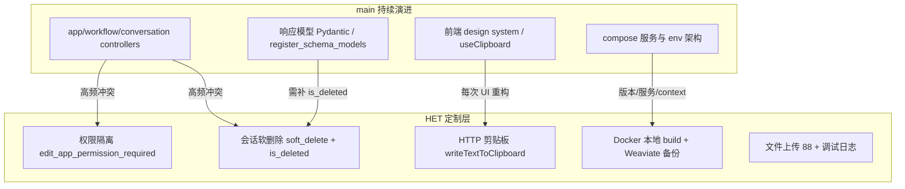

# HET 二次开发记录及未来计划

**文档版本**：2026-06-22  
**维护分支**：`custom/het-dev-260117`  
**上游基准**：Dify 开源仓库 `main`（已与 `43192036fa` 完成合并，当前与本地 `main` 同步）  
**远程跟踪**：`gitlab-het/custom/het-dev-260117`

---

## 1. 背景与目标

本项目基于 [Dify](https://github.com/langgenius/dify) 开源平台进行二次开发，面向 HET 团队自托管部署与内部使用场景。二次开发不以 fork 上游全量功能为目标，而是在官方能力之上叠加：

- **运维本地化**：国内网络环境、本地 Docker 构建、Weaviate 数据备份与迁移
- **权限收紧**：工作区内 App 的修改/删除/覆盖导入仅限管理员或创建者
- **业务增强**：会话软删除（保留审计）、文件上传上限调整、Sandbox Excel 支持等
- **生产问题修复**：非 HTTPS 环境下剪贴板复制、工作流变量块崩溃隔离等

分支命名 `het-dev-260117` 表示 2026-01-17 前后启动的定制开发线；详细逐提交记录见 [`het-dev-260117-changelog.md`](./het-dev-260117-changelog.md)。

---

## 2. 项目结构速览

```
dify/
├── api/                 # 后端：Flask + DDD（controller → service → core）
├── web/                 # 前端：Next.js + TypeScript + React
├── docker/              # Docker Compose 全栈 / 中间件部署
├── docs/                # 官方多语言文档
├── sdks/                # 各语言 SDK
├── scripts/             # 辅助脚本
├── dev/                 # 实验性脚本（不进入生产构建）
├── migrate_weaviate_collections.py   # 【定制】Weaviate 集合迁移
├── docker/docker_fast_tool.sh      # 【定制】一键 build / 重部署
├── het-dev-260117-changelog.md     # 【定制】分支提交明细
└── AGENT_MERGE_RESULT.md           # 【定制】与 main 合并冲突分析
```

### 2.1 后端 `api/` 关键目录

| 目录 | 说明 |
|------|------|
| `controllers/console/app/` | 控制台 App / 会话 / 工作流 API（定制改动集中区） |
| `controllers/web/` | 终端用户 Web API（含会话软删除） |
| `services/` | 业务服务层（`conversation_service`、`app_dsl_service` 等） |
| `models/` | ORM 模型（`Conversation.is_deleted` 等） |
| `tasks/` | Celery 异步任务 |

CLI 约定：`uv run --project api <command>`。

### 2.2 前端 `web/` 关键目录

| 目录 | 说明 |
|------|------|
| `app/components/base/` | 基础 UI（复制、文件上传等定制组件） |
| `app/components/base/prompt-editor/plugins/workflow-variable-block/` | 工作流变量块（ErrorBoundary） |
| `service/` | API 调用层 |
| `i18n/` | 国际化（新增用户可见文案须走 `i18n/en-US/`） |

### 2.3 Docker 部署 `docker/`

| 资源 | 说明 |
|------|------|
| `docker-compose.yaml` | 生产全栈编排 |
| `docker-compose.middleware.yaml` | 开发用中间件（DB + Weaviate） |
| `.env` / `.env.example` | 环境变量（main 已拆分为 `docker/envs/`，HET 仍可用单文件 `docker/.env`） |
| `dify-env-sync.sh` | 升级时同步新增环境变量 |
| `docker_fast_tool.sh` | **定制**：`-b` 构建、`-r` 重部署、`-l` 跟日志 |

**定制镜像策略**：不使用官方云端镜像直接启动，而是本地 build 后打标签：

- `dify-api:1.14.2`（api / worker / worker_beat / api_websocket）
- `dify-web:1.14.2`
- `build.context: ..`（仓库根目录，非 `../web`）

官方 `langgenius/dify-*` 行在 compose 中保留为注释，便于对照版本。

---

## 3. 二次开发记录（按领域）

### 3.1 基础设施与 Docker（2026-01-17 ~ 2026-05-20）

| 日期 | 提交 | 内容 |
|------|------|------|
| 01-17 | `14cef88d5e` | Weaviate 备份兼容：`.gitignore` 与 compose 编排 |
| 01-13 | `52f9174ca3` | 一体化大改：Weaviate 迁移脚本与备份卷、Sandbox 放宽 syscall、上传上限 88、调试日志、`NUMEXPR_MAX_THREADS` |
| 01-20 | `2440c68831` | 规范化 Weaviate 备份启用方案 |
| 01-19 | `7f6ecee630` | Web Dockerfile 使用国内 npm 镜像 |
| 02-04 | `372aa842e9` | 新增 `docker_fast_tool.sh` 部署辅助脚本 |
| 02-04 | `3b6faf6410` | 修复 compose 重复 build |
| 02-04 | `1f20aeadd5` | build 输出增加 `--progress=plain` |
| 02-26 | `2ab2cfb242` | 简化 Docker build 命令 |
| 05-20 | `22db3c2377` | SSRF 代理（squid）允许访问本地网络 |

**涉及文件（代表性）**：

- `docker/docker-compose.yaml`、`docker-compose-template.yaml`
- `docker/volumes/sandbox/conf/config.yaml`
- `docker/volumes/sandbox/dependencies/python-requirements.txt`
- `docker/ssrf_proxy/squid.conf.template`
- `migrate_weaviate_collections.py`（新增，423 行）
- `web/Dockerfile`

### 3.2 App 权限隔离（2026-02-04）

| 提交 | `e2fe486883` |
|------|----------------|
| 目标 | 禁止非管理员修改/删除他人创建的 App；覆盖导入时校验创建者身份 |

**实现要点**：

1. **装饰器** `edit_app_permission_required`（`api/controllers/console/app/wraps.py`）  
   - 允许：工作区 admin/owner，或 App 的 `created_by`  
   - 拒绝：其他 editor 角色 → `403 Forbidden`

2. **挂载端点**（`app.py`、`workflow.py` 等）：`PUT`/`DELETE` 及工作流发布类操作

3. **导入校验**（`app_import.py`、`app_dsl_service.py`）：`app_id` 覆盖导入时，非 admin/owner 且非原创建者则拒绝（controller 与 service 双处校验）

### 3.3 会话软删除（2026-02-05）

| 提交 | `6d0cdc7edd` |
|------|----------------|
| 目标 | 用户侧「删除」会话不物理抹除，便于管理员审计与恢复查阅 |

**实现要点**：

1. `ConversationService.soft_delete()`：将 `is_deleted` 置为 `True`
2. **Web 端**（`controllers/web/conversation.py`）：用户删除走软删
3. **Console 端**（`controllers/console/app/conversation.py`）：列表**包含**已软删会话（注释：*Console queries include soft-deleted conversations so admins can view all logs*）
4. 普通查询路径仍过滤 `is_deleted == False`（`conversation_service.py`）

### 3.4 前端功能与修复

| 日期 | 提交 | 内容 |
|------|------|------|
| 01-19 | `421eff1d3f` | 工作流文件数量上限调整（更合理方式） |
| 02-06 | `7448ad4922` | 简化聊天组件文件处理（后经 revert 链部分回退，最终 `2962d6b177` 保留部分改动） |
| 02-26 | `2ab2cfb242` | `WorkflowVariableBlockComponent` 增加 `ErrorBoundary`，防止 ReactFlow 外崩溃 |
| 03-03 | `7bbcca1103` | 非安全上下文（非 HTTPS）剪贴板复制：自定义 `writeTextToClipboard` 替代 `useClipboard` |
| 03-06 | `4d01fff00e` | Sandbox 增加 openpyxl / xlsxwriter / xlwt |
| 04-17 | `5697ea8a43` | Sandbox 增加 xlrd（Excel 读取增强） |

**涉及组件**：`copy-feedback`、`copy-icon`、`input-with-copy`、`file-uploader/*`、`workflow-variable-block/component.tsx`

### 3.5 其他

| 日期 | 提交 | 内容 |
|------|------|------|
| 01-20 | `c8f73f6b8d` | 修复 Swagger UI 页面无法访问 |
| 03-06 ~ 03-13 | `9e2fc4e2d0` / `62c1d7b64e` | Python 类型提示规范更新后 revert（与上游工具链未对齐，暂回退） |
| 05-20 | `25f1f2c448` | `.gitignore` 增加 `tmp/` 目录 |

---

## 4. 分支与上游差异现状

> 统计时间：2026-06-22（已与 `main` @ `43192036fa` 完成合并）

| 指标 | 值 |
|------|-----|
| 定制分支 tip | `512ba0b401`（含合并提交 `ecfe4f4085`） |
| 本地 `main` tip | `43192036fa` |
| merge-base | `43192036fa`（与 `main` 已对齐） |
| 领先 `main` | **41** 提交（含定制开发与合并提交） |
| 落后 `main` | **0** |
| 差异文件数 | **37** 个（约 +5310 / -71 行） |
| 工作区 | 干净 |

### 4.1 相对 `main` 的核心差异总览

| 领域 | 定制内容 | 关键文件 |
|------|----------|----------|
| **App 权限隔离** | 非 admin/owner 不能改/删他人创建的 App；覆盖导入需校验创建者 | `wraps.py`（`edit_app_permission_required`）、`app.py`、`workflow.py`、`app_import.py`、`app_dsl_service.py` |
| **会话软删除** | Web 端删除改为 `soft_delete`；Console 列表**包含**已删会话；响应模型暴露 `is_deleted` | `conversation_service.py`、`controllers/web/conversation.py`、`controllers/console/app/conversation.py`、`conversation_fields.py`、DB migration |
| **剪贴板（HTTP）** | 自定义 `writeTextToClipboard`（`execCommand` 兜底），不用 `foxact/use-clipboard` | `web/utils/clipboard.ts`、copy-feedback / copy-icon / input-with-copy |
| **工作流变量块** | `ErrorBoundary` + Fallback 组件（ReactFlow 外粘贴不崩） | `workflow-variable-block/component.tsx` |
| **文件上传** | 上限 88、调试 `console.debug`、上传逻辑增强 | `file-uploader/*`、`web/service/base.ts` |
| **Docker 本地构建** | 本地镜像 `dify-api/web:1.14.2` + `build`；Weaviate 备份模块；SSRF 允许本地网 | `docker-compose-template.yaml`、`web/Dockerfile`（npmmirror）、`ssrf_proxy`、`sandbox` |
| **运维脚本/数据** | `docker_fast_tool.sh`、`migrate_weaviate_collections.py`（423 行） | 新增文件 |
| **调试向改动** | `next.config.ts` 开 source map、关 minify；file-uploader 大量 debug 日志 | `next.config.ts`、`hooks.ts` |

### 4.2 差异结构（便于记忆）



### 4.3 下次合并高风险区域（🔴）

上游改动频繁且 HET 也有定制，**最易再次冲突**：

| 文件 | main 近 3 月提交频率 | 定制要点 | 易错点 |
|------|---------------------|----------|--------|
| `api/controllers/console/app/app.py` | ~48 | 6 个端点用 `edit_app_permission_required` 替代 `edit_permission_required` | 新端点默认上游装饰器，漏换权限装饰器；trace 端点装饰器顺序敏感 |
| `api/controllers/console/app/conversation.py` | ~20 | 去掉两处 `is_deleted.is_(False)`，Console 可见软删会话 | main 重加过滤会覆盖软删可见性；`conversation_fields.py` 的 `is_deleted` 被删则前端丢状态 |
| `api/controllers/console/app/workflow.py` | ~31 | publish 叠加 `@edit_app_permission_required` + `@with_current_user` | 装饰器顺序错导致参数注入失败；新写操作端点需判断是否加权限 |
| 复制三组件 + `clipboard.ts` | ~13 | main UI + `writeTextToClipboard` 复制逻辑 | 半合并易出现 `reset`/`copy` 未定义；每次 UI 重构都冲突 |
| `docker/docker-compose-template.yaml` | ~44 | 本地 `build`、`context: ..`、本地镜像 tag、Weaviate 备份 | `context` 被改回 `../web` 导致 build 失败；新服务未改本地镜像 |
| `web/Dockerfile` | ~13 | 启用 npmmirror | build context 与 COPY 路径必须一起核对 |

### 4.4 下次合并中风险区域（🟡）

| 区域 | 说明 |
|------|------|
| `app_import.py` + `app_dsl_service.py` | 导入权限在 controller 与 service 双份，main 重构 `AppDslService` 时易只保留一侧 |
| `workflow-variable-block/component.tsx` | Fallback + ErrorBoundary + 旧变量函数与 `isSpecialVar` 并存，变量体系重构时易编译失败 |
| `file-uploader/*` | `MAX_FILE_UPLOAD_LIMIT=88`、debug 日志；合并后注意清理误留的 `console.debug` |
| 环境变量 | HET 仍用单文件 `docker/.env`；main 拆到 `docker/envs/`。一般不冲突，但新功能强依赖变量时易「能跑但功能残缺」 |

### 4.5 低风险区域（🟢）

| 内容 | 说明 |
|------|------|
| `migrate_weaviate_collections.py` | 新增脚本，很少冲突 |
| `docker_fast_tool.sh` | 本地运维脚本 |
| `docker/ssrf_proxy/squid.conf.template` | 单行本地网络放行 |
| `sandbox` Python 依赖（openpyxl/xlrd 等） | 独立小块 |
| DB migration（`is_deleted`） | 已落地；main 若动 Conversation 表结构需人工核对 |
| `.gitignore`（`tmp/`、`.codegraph/`） | union 即可 |

### 4.6 已完成合并的冲突处理（2026-06-18）

详见 [`AGENT_MERGE_RESULT.md`](./AGENT_MERGE_RESULT.md)。摘要：

| 文件 | 处理结论 |
|------|----------|
| `conversation.py` | 采用 `register_schema_models`；**保留** Console 不过滤软删逻辑 |
| `conversation_fields.py` | 联动补回 `is_deleted` 字段 |
| `app_import.py` | 权限校验 + `Session(expire_on_commit=False)` 并存 |
| `docker-compose*.yaml` | 保留本地 `build`，版本对齐 1.14.2 |
| 复制三组件 | main shadcn Tooltip UI + `writeTextToClipboard` |
| `workflow-variable-block` | union import，保留 ErrorBoundary |

### 4.7 合并原则（团队约定）

1. **功能性改动**（权限隔离、软删除、Weaviate 备份、本地 build、HTTP 复制等）→ **保留 `custom/het-dev-260117` 逻辑**
2. **Bug 修复性改动**（上游已修复的同类问题）→ **优先采用 `main`**
3. Docker：不切换为云端官方镜像启动，本地 build；compose 其余编排跟随上游
4. `.env`：只补 main 新增且需要的变量，**不要整文件覆盖**（会丢失 `SECRET_KEY`、外网 URL 等定制）

### 4.8 下次合并检查清单

合并 `main` 后按优先级逐项核对：

- [ ] **`app.py` / `workflow.py`**：改 App / 发 workflow 类端点仍为 `edit_app_permission_required`；publish 装饰器顺序 `get_app_model` → `with_current_user` → `edit_app_permission_required`
- [ ] **`conversation.py` + `conversation_fields.py`**：Console 列表仍**不过滤** `is_deleted`；Pydantic 模型仍有 `is_deleted`
- [ ] **`controllers/web/conversation.py`**：删除仍调用 `soft_delete`
- [ ] **复制三组件**：main Tooltip UI + `writeTextToClipboard`，无 `useClipboard` 残留
- [ ] **`docker-compose-template.yaml`**：`build.context: ..`、`dockerfile: api/Dockerfile` / `web/Dockerfile`、本地镜像 tag；新服务也指向 `dify-api`
- [ ] **`web/Dockerfile`**：npmmirror 行保留；COPY 路径与 context 匹配
- [ ] **`.env`**：按需补 main 新增变量，不整文件替换
- [ ] **构建验证**：`docker compose -p dify build`（至少 api + web）

### 4.9 技术债（影响长期合并成本）

| 项 | 现状 | 建议 |
|----|------|------|
| 权限校验 | controller + `app_dsl_service` 双份 | 长期收敛到 service 一层 |
| `next.config.ts` 调试配置 | 关 minify、开 source map | 生产前评估是否保留 |
| file-uploader `console.debug` | 调试用 | 稳定后删除 |
| 复制方案 | 与 upstream `useClipboard` 分叉 | 封装 adapter，合并时只改 adapter |
| Docker | template 与 compose 需手动同步 | 合并后跑 `generate_docker_compose` 再叠本地 build 段 |

### 4.10 已知回归：share 匿名页跳 console 登录页（2026-06-29 确认）

**现象**：合并 main 后，匿名访问 `/chat/[token]`、`/chatbot/[token]` 会跳转到 `/signin`（console 登录页）；`/workflow/[token]` 不跳。合并前不跳。

**根因**（main 引入，非 HET 定制）：

- main 提交 `dea4e66456 fix(web): use generated account-profile contracts (#36927)` 把 `web/hooks/use-timestamp.ts` 从「`useAppContext()` 取 `userProfile.timezone`（无网络请求）」改成「`useQuery(userProfileQueryOptions())` → `GET /console/api/account/profile`」。
- 调用链：share chat 渲染 `Chat` → `useChat`（`web/app/components/base/chat/chat/hooks.ts:69` 调 `useTimestamp()`）→ `GET /console/api/account/profile`。
- share 页面是匿名 end_user，无 console 登录态 → 401 → `web/service/base.ts` `request` 非 public 分支调 `refreshAccessTokenOrReLogin` → `GET /console/api/refresh-token` 也 401 → `jumpTo(buildSigninUrlWithRedirect())` 跳 `/signin`。
- `/workflow` 走 `text-generation`，不渲染 `Chat`、不调 `useTimestamp`，故不跳。
- merge-base `20e91990bf` 时 `use-timestamp.ts` 用 `useAppContext()`，不发请求，故旧版不跳。

**后端无需改动**（已验证 CE 下 `webapp_auth.enabled=false`、accessMode=public、passport/site/parameters/conversations 带 passport 全 200）。

**修复方案**（2026-06-29 已实施，方案 A 定制版）：

- 改动文件：[`web/hooks/use-timestamp.ts`](web/hooks/use-timestamp.ts)
- share 路由（`/chat`、`/chatbot`、`/workflow`、`/completion`、`/webapp-signin`、`/webapp-reset-password`）下 `useQuery(userProfileQueryOptions(), { enabled: false })`，**不发** `/console/api/account/profile`
- 无登录用户时消息时间戳固定 `Asia/Shanghai`（UTC+8）；console / explore 等已登录路由仍拉 profile 用 `profile.timezone`

**验证方法**（需 rebuild web 后执行）：

1. 隐身窗口访问 `/chatbot/[token]`、`/chat/[token]` → 不跳 `/signin`
2. DevTools Network 确认无 `/console/api/account/profile`、`/console/api/refresh-token`
3. `/workflow/[token]` 仍正常；已登录 console 后 `/apps` 等页面时间戳仍跟 profile timezone

**实测印证**（2026-06-29 用户复现）：清浏览器 localStorage 后访问 `http://10.16.8.54:18080/chatbot/LvMBDwt4Bnkizljv`，DevTools Network 确认首个 401 为 `/console/api/account/profile`，随后 `/console/api/refresh-token` 401，随即跳 `/signin`；同 token 的 `/workflow` 不跳。服务器端直连探测（绕过浏览器）确认后端正常：`GET /api/passport` 200、带 passport 请求 `/api/site`/`/api/parameters`/`/api/meta`/`/api/conversations` 全 200、不带 passport 全 401 `unauthorized`、`webapp_auth.enabled=false`、`accessMode=public`。问题纯前端，定论与上文根因一致。

---

## 5. 当前进度总结

### 已完成

- [x] 权限隔离装饰器与导入校验落地（含 `app_dsl_service.py`）
- [x] 会话软删除（Web 删 / Console 可查）
- [x] Docker 本地化构建链路与 `docker_fast_tool.sh`
- [x] Weaviate 备份、迁移脚本与卷映射
- [x] 文件上传上限、Sandbox 依赖、SSRF 本地网络
- [x] 剪贴板非安全上下文修复、工作流变量块 ErrorBoundary
- [x] 分支提交明细文档 `het-dev-260117-changelog.md`
- [x] 与 `main` 合并冲突预分析 `AGENT_MERGE_RESULT.md`
- [x] **与上游 `main` 合并**（`43192036fa`，2026-06-18，合并提交 `ecfe4f4085`）
- [x] 合并后 `conversation.py` 迁移至 `register_schema_models` 并保留软删除行为
- [x] 镜像版本对齐上游 **1.14.2**，保留本地 `build`
- [x] share 匿名页跳 `/signin` 回归修复（`use-timestamp.ts` share 路由跳过 profile 请求 + `Asia/Shanghai` 回退）

### 未完成 / 进行中

- [ ] 合并后全链路手工 / 自动化回归（权限、软删除、复制、文件上传、Docker 部署；**含 share 匿名页修复验证**）
- [ ] `.env` 按需补全 main 新增变量（保留单文件 `.env` 策略亦可）
- [ ] 评估并清理调试向改动（`next.config.ts` minify、`console.debug` 等）
- [ ] 镜像版本与上游 release 的持续对齐机制

---

## 6. 未来计划

### 6.1 近期（P0）：合并后回归与稳定

**目标**：验证 2026-06-18 与 `main` 合并结果，确保 HET 定制功能在 1.14.2 基线上正常工作。

| 步骤 | 动作 | 验收标准 |
|------|------|----------|
| 1 | 按 **4.8 合并检查清单** 逐项核对 | 权限、软删、复制、Docker build 无回退 |
| 2 | `docker compose -p dify build` | api + web 构建成功（`context: ..`） |
| 3 | 关键路径回归 | 见 6.3 测试清单 |
| 4 | `.env` 按需补变量 | 不整文件覆盖；新功能变量按需添加 |
| 5 | 推送 `gitlab-het`（经 review） | 远程与本地一致 |

### 6.2 中期（P1）：跟踪上游与削减分叉

| 事项 | 说明 |
|------|------|
| 定期合并 `main` | 重点关注 **4.3 ~ 4.5** 所列文件；合并后跑 **4.8 检查清单** |
| 削减前端分叉 | 评估 `writeTextToClipboard` 是否仍必要；可封装 adapter 降低冲突 |
| 类型检查规范 | 重新评估工具链改动，与上游 `make type-check` 对齐后择机引入 |
| 权限模型文档化 | 在团队内部 wiki 说明 `edit_app_permission_required` 与角色矩阵 |
| Weaviate 运维手册 | 备份恢复、迁移脚本使用场景与回滚步骤 |
| 清理技术债 | 见 **4.9**：debug 日志、双份权限校验、compose 生成流程 |

### 6.3 中期（P1）：测试与回归清单

合并或发版前至少覆盖：

**后端**

- [ ] 非创建者 editor 修改他人 App → 403
- [ ] 非创建者覆盖导入他人 App → 403
- [ ] admin/owner 可修改任意 App
- [ ] Web 用户删除会话 → `is_deleted=True`，数据仍在库
- [ ] Console 会话列表可见已软删记录

**前端**

- [ ] HTTP（非 HTTPS）环境下复制按钮可用
- [ ] 工作流编辑器变量块拖拽/粘贴不白屏
- [ ] 工作流发布文件上传（大文件 / 多文件边界）
- [ ] **share 匿名页不跳 console 登录页**（见 4.10）：
  - `/chat/[token]`、`/chatbot/[token]` 不跳 `/signin`
  - `/workflow/[token]`、`/completion/[token]` 不跳 `/signin`

**Docker**

- [ ] `./docker_fast_tool.sh -b -r` 全流程
- [ ] Weaviate 备份卷写入与 `migrate_weaviate_collections.py` 干跑
- [ ] Sandbox Excel 相关工具调用

### 6.4 长期（P2）：演进方向

| 方向 | 描述 |
|------|------|
| 上游贡献回流 | 将通用修复（如 ErrorBoundary、剪贴板）整理为上游 PR，减少长期分叉 |
| CI 流水线 | 在 `gitlab-het` 增加 build + lint + 核心 API 测试，合并 main 后自动触发 |
| 版本标签策略 | 定制镜像采用 `dify-api:het-<date>` 或 `het-<upstream-version>` 语义化标签 |
| 配置外置 | 将 HET 特有环境变量（上传上限、SSRF 策略等）收敛到 `.env` 文档与模板，减少代码硬编码 |
| 多环境 compose | 视需要拆分 `docker-compose.het.yaml` overlay，与上游 `docker-compose.yaml` 解耦 |

---

## 7. 相关文档索引

| 文档 | 用途 |
|------|------|
| [`README.md`](./README.md) | Dify 官方项目介绍与快速启动 |
| [`docker/README.md`](./docker/README.md) | Docker Compose 部署说明 |
| [`AGENTS.md`](./AGENTS.md) | 仓库级开发约定 |
| [`api/AGENTS.md`](./api/AGENTS.md) | 后端开发规范 |
| [`web/AGENTS.md`](./web/AGENTS.md) | 前端开发规范 |
| [`het-dev-260117-changelog.md`](./het-dev-260117-changelog.md) | 分支逐提交明细（3944 行） |
| [`AGENT_MERGE_RESULT.md`](./AGENT_MERGE_RESULT.md) | 与 `main` 合并冲突分析与操作策略 |

---

## 8. 修订记录

| 日期 | 说明 |
|------|------|
| 2026-06-11 | 初版：基于仓库探索、`git log` 与 `AGENT_MERGE_RESULT.md` 整理二次开发记录与未来计划 |
| 2026-06-22 | 合并完成后更新：刷新分支状态（已与 `main` @ `43192036fa` 对齐）；新增 4.1~4.9 核心差异、合并风险分级、检查清单与技术债；更新进度与未来计划 |
| 2026-06-29 | 新增 4.10：确认 share 匿名页（`/chat`、`/chatbot`）跳 `/signin` 的根因——main `#36927` 改 `useTimestamp` 调 `/console/api/account/profile`，匿名 401 触发跳转；候选修复 A/B/C 待定，6.3 前端回归清单补对应验证项 |
